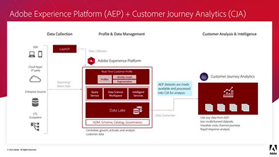

# Tutorial su Customer Journey Analytics

Ti diamo il benvenuto nel sito dei tutorial di [!DNL Customer Journey Analytics].  Segui questi tutorial e consulta la [documentazione](https://experienceleague.adobe.com/docs/analytics-platform/using/cja-landing.html?lang=it) per comprendere meglio come utilizzare Adobe Analytics per acquisire approfondimenti multicanale sul cliente in modo più rapido che mai.  Per iniziare,

* Scopri le **Novità** nella sezione qui di seguito.
* Nella sezione **Proposte del nostro staff** sono evidenziati alcuni dei nostri contenuti preferiti.
* Nella sezione di **navigazione a sinistra** puoi esplorare i contenuti per argomento e sottoargomento.
* Utilizza il campo **Rierca**, in alto, per eseguire ricerche mirate.

Customer Journey Analytics consente di controllare come collegare i dati online e offline in Analysis Workspace su qualsiasi ID cliente comune, per poter poi eseguire attività di attribuzione, segmentazione, flusso, abbandono e così via sull’intero set di dati cliente.

## Proposte del nostro staff

<table>
<tr>
  <td>
    
    

      <a href="visitor-id/understanding-how-customer-journey-analytics-uses-identity.md">
    <strong>Utilizzo dell'identità in Customer Journey Analytics</strong>
    </a>
    

    

    <em>Sguardo pratico al modo in cui l’identità influisce sull’analisi in Customer Journey Analytics</em>
    

  </td>
   <td>
    
    

      <a href="architecture/architecture-and-integrations-of-cja.md">
    <strong>Architettura e integrazioni di Customer Journey Analytics</strong>
    </a>
    

    

    <em>Panoramica dell’architettura di Customer Journey Analytics, inclusa l’integrazione con Adobe Experience Platform.</em>
    

  </td>
  <td>
    
    

      <a href="analysis-workspace/visualizations/cross-channel-attribution-in-customer-journey-analytics.md">
    <strong>Attribuzione cross-channel in Customer Journey Analytics</strong>
    </a>
    

    

    <em>Come utilizzare le visualizzazioni per mostrare l’attribuzione (riconoscere il merito) per i diversi canali.</em>
    

  </td>
</tr>
</table>

