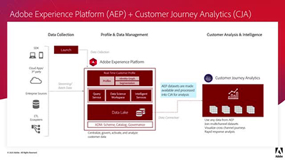

# Panoramica

Benvenuto/a nel sito delle esercitazioni [!DNL Customer Journey Analytics] .  L&#39;utilizzo di queste esercitazioni insieme alla [documentazione](https://docs.adobe.com/content/help/it-IT/analytics-platform/using/cja-landing.html) ti fornirà una migliore comprensione di come utilizzare Adobe Analytics per ottenere informazioni sui clienti multicanale più rapidamente che mai.  Per iniziare,

* Per informazioni aggiornate, consulta la sezione **&quot;Novità&quot;**
* **Il personale** illumina alcuni dei nostri contenuti preferiti
* Esplora il contenuto per argomento e sottoargomento nella **navigazione a sinistra**
* Utilizza il campo **search** nella parte superiore della pagina se sai cosa stai cercando

Customer Journey Analytics consente di controllare come collegare i dati online e offline in Analysis Workspace su qualsiasi ID cliente comune, per poter poi eseguire attività di attribuzione, segmentazione, flusso, fallout e così via nell’intero set di dati del cliente.

## Novità

* **[Spostare i segmenti di Adobe Analytics in Customer Journey Analytics (video)](/help/moving-adobe-analytics-segments-to-customer-journey-analytics.md)**

   *Scopri come ricreare i segmenti di Adobe Analytics in Customer Journey Analytics*

* **[Sposta le metriche calcolate da Adobe Analytics a Customer Journey Analytics (video)](/help/moving-your-calculated-metrics-from-adobe-analytics-to-customer-journey-analytics.md)**

   *Scopri suggerimenti per ricreare le metriche calcolate di Adobe Analytics in Customer Journey Analytics*

* **[Creare filtri tra canali (video)](/help/creating-cross-channel-filters-in-customer-journey-analytics.md)**

   *Creare filtri in Customer Journey Analytics che utilizzano più di un’origine dati e più di un canale*

## Scelte dello staff

<table>
<tr>
  <td>
    
    

      <a href="/help/understanding-how-customer-journey-analytics-uses-identity.md">
    <strong>Informazioni su come Customer Journey Analytics utilizza l’identità</strong>
    </a>
    

    

    <em>Panoramica pratica sul modo in cui l’identità influisce sull’analisi in Customer Journey Analytics</em>
    

  </td>
   <td>
    
    

      <a href="/help/architecture-and-integrations-of-cja.md">
    <strong>Architettura e integrazioni di Customer Journey Analytics</strong>
    </a>
    

    

    <em>Procedura dettagliata sull’architettura di Customer Journey Analytics, inclusa l’integrazione con Adobe Experience Platform.</em>
    

  </td>
  <td>
    
    

      <a href="/help/cross-channel-attribution-in-customer-journey-analytics.md">
    <strong>Attribuzione tra canali in Customer Journey Analytics</strong>
    </a>
    

    

    <em>Come utilizzare le visualizzazioni per mostrare l’attribuzione (riconoscere il merito) tra i diversi canali.</em>
    

  </td>
</tr>
</table>
